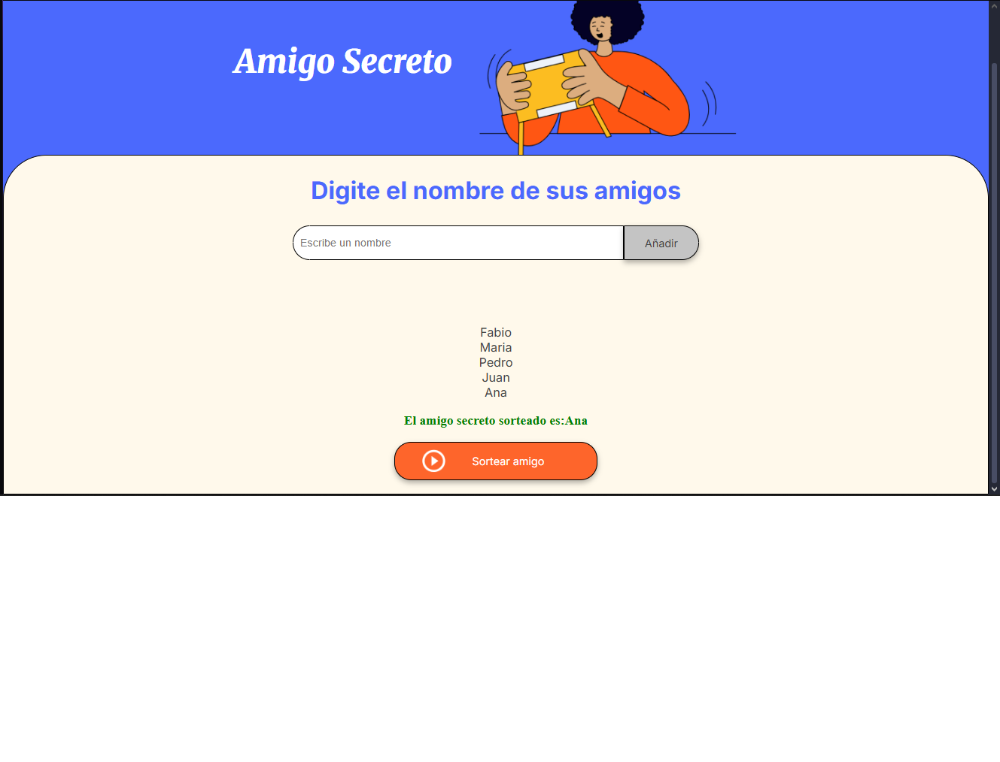

# 🎁 Challenge Amigo Secreto

Proyecto para practicar **JavaScript**, **HTML** y **CSS**, donde el usuario puede:

- Ingresar nombres de amigos.
- Visualizar la lista de participantes.
- Sortear aleatoriamente un amigo secreto.

---

## 🚀 Cómo usar

1. Clona este repositorio:
```bash
   git clone git@github.com:fabianestebanvega/Challenge-Amigo-Secreto.git 
   ```
   
2. Escribe un nombre y presiona **"Añadir"**.  
3. Cuando tengas la lista completa, haz clic en **"Sortear amigo"** para elegir uno al azar.

---

## 🛠️ Tecnologías utilizadas

- **HTML5** → Estructura del proyecto.
- **CSS3** → Estilos y diseño visual.
- **JavaScript** → Lógica para agregar y sortear nombres.

---

## 📷 Captura de pantalla



---

## 📄 Licencia

Este proyecto es de uso libre con fines educativos.